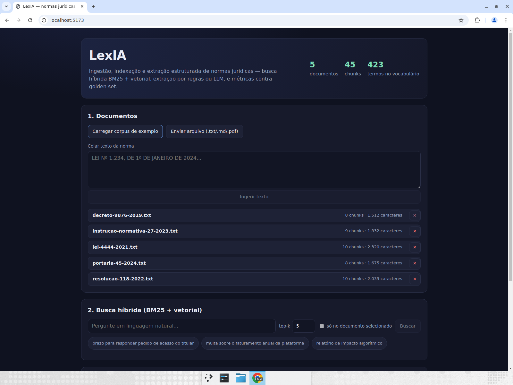
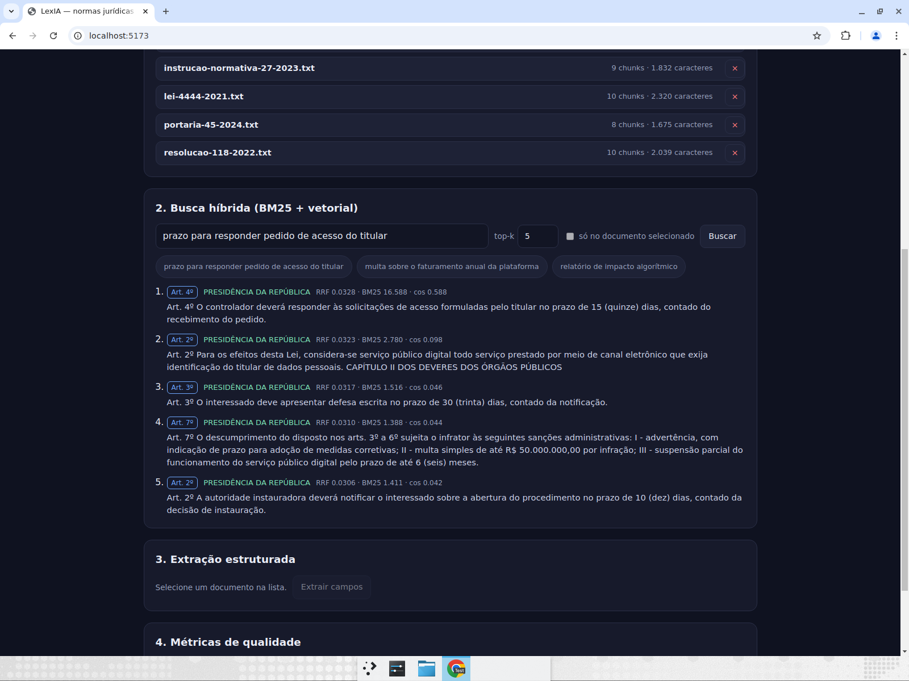
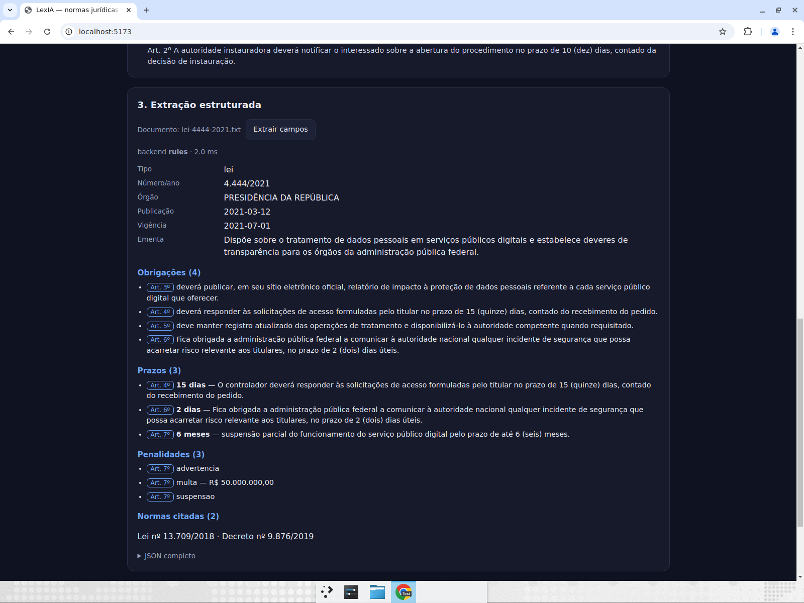
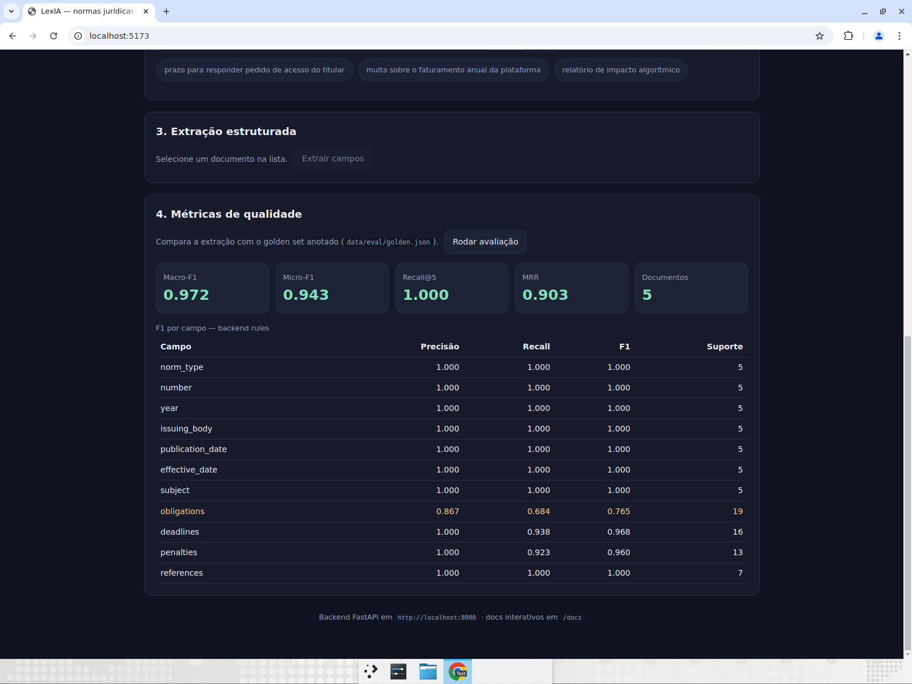

# LexIA — ingestão, indexação e extração estruturada de normas jurídicas

Pipeline completo para ler textos legais e normativos e transformá-los em **dados estruturados
auditáveis**: ingestão (TXT/MD/PDF) → chunking por artigo → busca híbrida (BM25 + vetorial) →
extração de campos jurídicos (regras **ou** LLM, mesmo schema) → **métricas contra golden set**.

Backend em **Python/FastAPI**, frontend em **React + TypeScript**, 127 testes automatizados
(113 pytest + 14 vitest) e um relatório de avaliação gerado pelo próprio projeto.

| | |
| --- | --- |
| Macro-F1 da extração (5 normas, golden set anotado) | **0.972** |
| Recall@5 / MRR da busca (12 consultas) | **1.000 / 0.903** |
| Cobertura de testes do backend | **95%** (`pytest --cov`, gate de 90%) |
| Dependência de serviço externo | **nenhuma** — roda 100% offline; LLM é opcional |



> Primeira vez aqui? [`COMECE_AQUI.md`](COMECE_AQUI.md) tem o passo a passo para rodar, publicar no
> GitHub e apresentar o projeto.

## Por que este projeto

Ler norma é um problema de extração estruturada com três dificuldades reais: (1) o texto tem
estrutura própria (artigos, parágrafos, capítulos) que se perde em chunking por tamanho fixo;
(2) consultas jurídicas misturam termo exato (“Lei nº 13.709”, “Art. 7º”) com semântica
(“prazo para responder o titular”), então nem busca lexical nem vetorial sozinha resolve; (3) sem
golden set não há como afirmar que um prompt novo é melhor que o anterior. O LexIA ataca os três e
**mede** o resultado.

## Rodando em 3 comandos

Pré-requisitos: Python ≥ 3.10 e Node ≥ 20.

```bash
# 1. backend
cd backend
python -m venv ../.venv && source ../.venv/bin/activate   # Windows: ..\.venv\Scripts\activate
pip install -e ".[dev]"
uvicorn app.api:app --reload --port 8000                  # docs em http://localhost:8000/docs

# 2. frontend (outro terminal)
cd frontend && npm install && npm run dev                 # http://localhost:5173

# 3. na interface: "Carregar corpus de exemplo" → busque → selecione um documento →
#    "Extrair campos" → "Rodar avaliação"
```

Sem interface? A CLI faz o mesmo:

```bash
cd backend
python -m app.cli ingest                                     # indexa data/corpus
python -m app.cli search "prazo para responder pedido de acesso do titular"
python -m app.cli extract lei-4444                           # extração em JSON
python -m app.cli eval --out ../docs/EVALUATION.md           # métricas
```

## Provas de que funciona

```bash
cd backend && pytest                 # 113 testes, cobertura 95% (gate --cov-fail-under=90)
cd backend && ruff check . && ruff format --check .
cd frontend && npm test             # 14 testes (React Testing Library)
cd frontend && npm run typecheck && npm run lint && npm run build
```

Saídas reais dessas execuções estão em [`docs/TEST_EVIDENCE.md`](docs/TEST_EVIDENCE.md) (com os logs
brutos em [`docs/evidence/`](docs/evidence)), as métricas em
[`docs/EVALUATION.md`](docs/EVALUATION.md) — interpretadas em
[`docs/EVALUATION_ANALYSIS.md`](docs/EVALUATION_ANALYSIS.md) — e os prints em
[`docs/screenshots/`](docs/screenshots).

| Busca híbrida | Extração estruturada | Métricas |
| --- | --- | --- |
|  |  |  |

## Como funciona

```
TXT/MD/PDF ─► ingestão ─► chunking por artigo ─┬─► BM25            ─┐
                                               └─► TF-IDF/cosseno  ─┴─► RRF ─► trechos
                                                                                  │
                  golden set ◄── métricas ◄── LegalNorm ◄── regras | LLM (prompt v1/v2)
```

- **Chunking consciente da estrutura** (`app/chunking.py`): corta em `Art. 1º`, `Artigo 2º`,
  propaga capítulo/seção, guarda `start_char`/`end_char` e gera ID determinístico (SHA-1) — dá
  rastreabilidade de cada resposta até o trecho original. Artigos longos são divididos com
  sobreposição.
- **Busca híbrida** (`app/index.py`, `app/retrieval.py`): BM25 (Okapi) para termo exato + TF-IDF
  com cosseno como vector store local, fundidos por **Reciprocal Rank Fusion** (escalas diferentes
  não se somam diretamente). A interface `add`/`search` é a mesma que Chroma/FAISS exporia: trocar
  por embeddings de verdade é substituir a classe, não o pipeline.
- **Extração estruturada** (`app/extraction/`): dois backends com o **mesmo contrato Pydantic**
  (`LegalNorm`), o que permite compará-los com as mesmas métricas:
  - `rules` (padrão, offline): regex + regras linguísticas, determinístico e auditável;
  - `llm`: Anthropic ou OpenAI, saída validada por Pydantic, com **uma tentativa de reparo** do
    JSON inválido e **fallback** para regras se o modelo falhar — a API nunca quebra por causa do LLM.
- **Prompts versionados** (`app/extraction/prompts.py`): `v1` e `v2`, com o diff de intenção
  documentado (o que a v2 corrige: `null` em vez de invenção, datas ISO, prazo como
  `value`+`unit`, evidência literal, uma obrigação por dever).
- **Avaliação** (`app/evaluation/`): precisão/revocação/F1 por campo, macro e micro-F1,
  `recall@k` e MRR para a busca. Listas (obrigações, prazos, penalidades) são pareadas 1-para-1 por
  similaridade de tokens, não por igualdade exata de string.

Detalhes de decisão técnica em [`docs/ARCHITECTURE.md`](docs/ARCHITECTURE.md); endpoints em
[`docs/API.md`](docs/API.md).

## Extração com LLM (opcional)

Nada é obrigatório: sem chave, o projeto roda inteiro com o extrator de regras.

```bash
export LEXIA_EXTRACTOR=llm
export LEXIA_LLM_PROVIDER=anthropic        # ou openai
export LEXIA_LLM_MODEL=claude-sonnet-4-5
export LEXIA_PROMPT_VERSION=v2             # v1 | v2
export ANTHROPIC_API_KEY=...               # nunca comitado; lido só do ambiente
```

Depois, `python -m app.cli eval` mede o ganho do LLM sobre o baseline no mesmo golden set.

## Corpus de exemplo

`data/corpus/` traz 5 normas **fictícias** (lei, decreto, resolução, instrução normativa e
portaria), marcadas como tal no próprio texto para não passarem por legislação real. A portaria foi
escrita de propósito em estilo diferente (“Compete ao…”, “É vedado…”) para **medir a degradação** do
extrator de regras — a lacuna aparece em `obligations` no relatório de avaliação.

## Limitações conhecidas (honestas)

- O extrator de regras detecta obrigação por verbo modal; formulações como “Compete ao”/“É vedado”
  ficam de fora (F1 0.765 em `obligations`, Macro-F1 0.727 na portaria). Corrigir com mais regex
  seria overfitting no golden set — o caminho é o backend LLM, e a métrica existe justamente para
  provar o ganho.
- TF-IDF não captura sinonímia como embeddings densos; a arquitetura já isola isso em uma classe.
- Persistência é um JSON local (`data/index/store.json`), adequado a demonstração, não a produção.

## Estrutura

```
backend/app/       ingestão, chunking, índices, extração (rules|llm), avaliação, API, CLI
backend/tests/     113 testes (unitários, integração da API e end-to-end da avaliação)
frontend/src/      React + TS: documentos, busca, extração e painel de métricas
data/corpus/       5 normas fictícias de exemplo
data/eval/         golden.json (anotação manual) + retrieval.json (12 consultas)
docs/              ARCHITECTURE, API, EVALUATION(+ANALYSIS), TEST_EVIDENCE, evidence/, screenshots/
```

Licença MIT.
